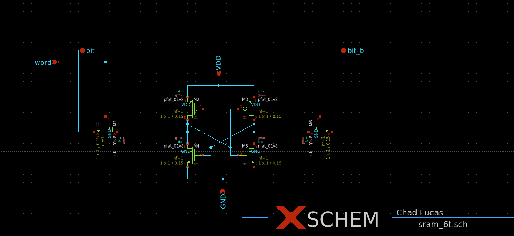

# Custom High-Speed 6T SRAM Bitcell Design (SkyWater 130nm PDK)

## Project Overview
This project focuses on designing and simulating a **custom 6-Transistor (6T) SRAM bitcell** using the open-source **SkyWater 130nm PDK**. The objective is to achieve a high-speed, robust SRAM bitcell suitable for integration with high-frequency sense amplifiers.

The work involves schematic design, layout implementation, and transient simulation to optimize read/write stability and access time.

---

## Features
- **Custom 6T SRAM bitcell design** with transistor sizing optimized for **read stability and writeability**.
- **Transient analysis using Ngspice** to evaluate bitline discharge rates under parasitic load capacitances.
- Achieved **<200ps read access time** with a robust **>1.0V bitline swing**.
- Suitable for integration in **100MHz+ high-speed SRAM arrays**.

---

## Key Results
- **Bitline differential:** 200mV in under 0.2ns.
- **Non-destructive reads** achieved across parasitic load capacitances of 500fF.
- Verified **strong pull-down drive strength** and **stability against read upset noise**.

---

## Simulation & Layout

### Xschem Schematic

### Transient Simulation
  
*Caption:* Transient Simulation of a 6T SRAM Read Operation at 1.8V. The design demonstrates a <200ps Read Access Time with a robust >1.0V Bitline Swing, verifying strong Pull-Down drive strength and stability against Read Upset noise.

### Magic Layout

---

## Tools & Technologies
- **SkyWater 130nm PDK**
- **Xschem** for schematic capture
- **Magic** for layout design
- **Ngspice** for transient simulation and analysis

---

## Work in Progress
This repository is a work in progress. Future improvements include:
- Write operation verification and optimization
- Full array-level simulation with peripheral circuitry
- Integration with high-speed sense amplifiers
- LVS/DRC verification and parasitic extraction

---

## Resume Highlights
- Designed and simulated a custom 6T SRAM bitcell using the Sky130 Open Source PDK.
- Optimized transistor sizing ratios (Beta Ratio) to balance Read Stability vs. Writeability, achieving non-destructive reads at 100MHz.
- Performed transient analysis using Ngspice to verify bitline discharge rates (dV/dt) across parasitic load capacitances (500fF).
- Achieved a bit differential of 200mV in under 0.2ns, suitable for high-frequency Sense Amplifier integration.

---

## File Structure
